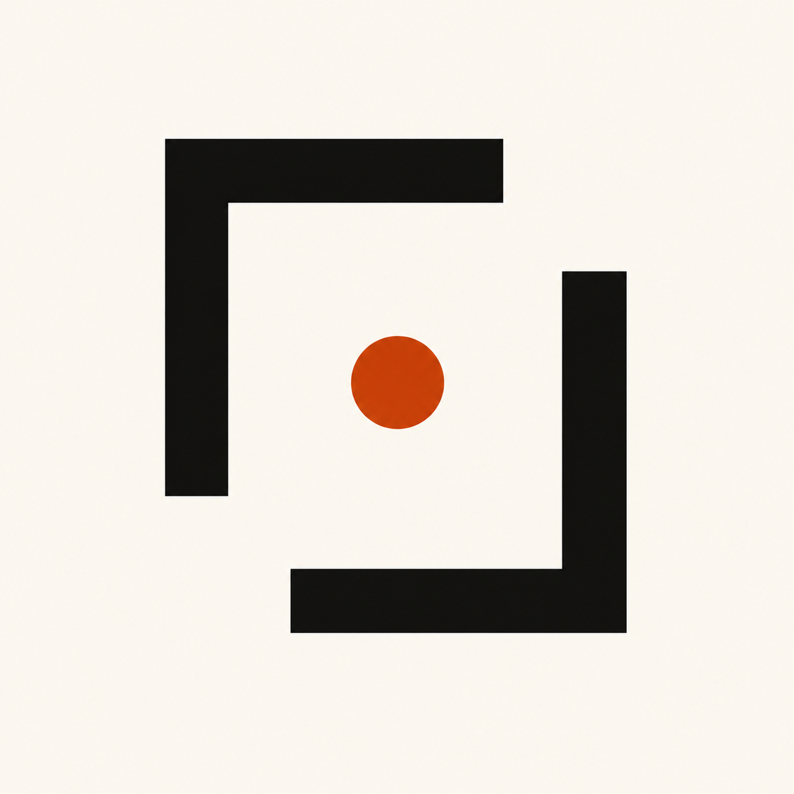

<div align="center">



# 🥖 Crust

**Components with a crust. Soft inside, sharp outside.**

A production-grade CSS component library — 100 hand-crafted effects, one editorial voice, zero slop.

<br />

### 🌐 Live Preview

<a href="https://h100css-compo-crust.netlify.app/">
  
</a>

<br />
<br />

<a href="https://github.com/huzaifaa-dev-vibe/100CSS-CRUST">
  
</a>
&nbsp;
<a href="https://github.com/huzaifaa-dev-vibe/100CSS-CRUST/releases">
  
</a>
&nbsp;
<a href="https://github.com/huzaifaa-dev-vibe/100CSS-CRUST/blob/main/CONTRIBUTING.md">
  
</a>

<br />
<br />

[](LICENSE)
[](https://nextjs.org/)
[](https://www.typescriptlang.org/)
[](https://tailwindcss.com/)
[](https://github.com/huzaifaa-dev-vibe/100CSS-CRUST/stargazers)
[](https://github.com/huzaifaa-dev-vibe/100CSS-CRUST/forks)
[](https://github.com/huzaifaa-dev-vibe/100CSS-CRUST/issues)
[](https://github.com/huzaifaa-dev-vibe/100CSS-CRUST/commits)

</div>

---

> 🥖 **A protest against the purple-to-blue-gradient, glassmorphism-everywhere, glow-on-hover web.** Crust is what happens when a component library decides to act like a magazine.

## 🎯 What is Crust?

Crust is a CSS component library built on three convictions:

1. **🎨 CSS is the source of truth.** Every component works without JavaScript. Behavior is a progressive enhancement layered on top — never a prerequisite.
2. **🚫 No slop.** No purple. No blue. No neon gradients. No glassmorphism. No glow. Just warm paper, ink hairlines, and a single rust accent that earns its place.
3. **📐 Editorial discipline.** Numbered sections. Small-caps mono labels. Generous whitespace. Asymmetric grids. The rigor of a Swiss magazine applied to a component library.

The result is a system that feels hand-crafted at every scale — small enough to read in one sitting, opinionated enough to ship in production, quiet enough to get out of the way of your content.

## ✨ What's inside

**100 hand-crafted components** across **12 categories**. Every one has a live preview, copy-pasteable HTML + CSS, and zero required dependencies.

| # | Category | Count | Highlights |
|---|----------|:-----:|------------|
| 01 | 🔘 **Buttons** | 15 | Fill Slide, Ripple Ink, Border Trace, Push 3D, Magnetic |
| 02 | ⌨️ **Inputs** | 10 | Floating Label, OTP Cells, Tag Input, Password Reveal |
| 03 | 🃏 **Cards** | 12 | Tilt 3D, Hover Reveal, Flip, Spotlight, Stat Block |
| 04 | ⏳ **Loaders** | 10 | Ring Rotate, Dot Wave, Skeleton Shimmer, Clock Tick |
| 05 | 🔄 **Toggles** | 8 | Switch Square, Segmented Control, Accordion, Dial |
| 06 | 💬 **Tooltips** | 5 | Arrow Drop, Side Slide, Rich Card, Magnetic Follow |
| 07 | 🍞 **Toasts** | 5 | Slide In, Auto Dismiss, Action Stack, Error Block |
| 08 | 📊 **Progress** | 8 | Linear Rust, Radial Circle, Spiral Trace, Upload Stack |
| 09 | 🧭 **Navigation** | 7 | Breadcrumb, Pagination Dots, Menu Strike, Tree Nested |
| 10 | ✍️ **Text** | 10 | Scramble, Outline Fill, Glitch, Marquee, Split Reveal |
| 11 | 🎨 **Backgrounds** | 5 | Dot Grid, Grid Paper, Halftone, Noise Paper |
| 12 | 🏷️ **Badges** | 5 | Status Dot, Numbered Tag, Count Chip, Ribbon Corner |

## 🚀 Quick start

```bash
# Clone
git clone https://github.com/huzaifaa-dev-vibe/100CSS-CRUST.git
cd 100CSS-CRUST

# Install (bun recommended — npm/pnpm also work)
bun install

# Dev server → http://localhost:3000
bun run dev

# Production build
bun run build && bun run start

# Lint
bun run lint
```

**Requirements:** Node.js 18.18+ · bun 1.0+ (or npm/pnpm equivalent)

<div align="center">

**⬆️ Or just look at the live preview →**

<a href="https://h100css-compo-crust.netlify.app/">
  
</a>

</div>

## 🎨 Design system

### 🌈 Palette — eight colors, no more

| Token | Value | Use | Swatch |
|-------|-------|-----|--------|
| `--ink` | `#0E0E0C` | Primary text, borders |  |
| `--paper` | `#F4F1EA` | Background (warm off-white) |  |
| `--bone` | `#E8E3D6` | Surfaces, cards |  |
| `--rust` | `#C2410C` | Primary accent (CTA, highlights) |  |
| `--moss` | `#3F5B3A` | Secondary accent |  |
| `--ochre` | `#D4A24C` | Tertiary / badges |  |
| `--clay` | `#8C5A3C` | Muted accent |  |
| `--smoke` | `#6B6660` | Muted text |  |

### 🌙 Dark mode — the "kiln" theme

Crust ships with a warm inverted palette: charred paper background (`#14110D`), warm off-white ink (`#ECE6D7`), brighter accents tuned for dark surfaces. Every component adapts automatically.

**Three ways to switch themes** — designed for humans and agents alike:

```bash
# 1. URL param — best for HTTP-only agents (curl, fetch, scrapers, LLM tools)
#    The .dark class is on <html> in the first byte of server-rendered HTML.
curl "https://h100css-compo-crust.netlify.app/?theme=dark"

# 2. Nav toggle — click the sun/moon button in the top-right of the site.

# 3. Programmatic — for embedded scripts / browser console
localStorage.setItem("theme", "dark"); location.reload();
```

### ✍️ Typography

- **Display:** [Fraunces](https://fonts.google.com/specimen/Fraunces) (variable, `opsz` 144, soft serif with personality)
- **UI / Body:** [Inter Tight](https://fonts.google.com/specimen/Inter+Tight)
- **Mono:** [JetBrains Mono](https://www.jetbrains.com/lp/mono/)

### 📐 Geometry

- **Borders:** `1.5px solid var(--ink)` — always
- **Radius:** 0 to 6px max — keep it crisp (pills are the only exception at `999px`)
- **Grain:** Subtle SVG noise overlay at 4% opacity (multiply on light, screen on dark)

## 📰 Announcement — Two changes coming in July 2026

<div align="center">

| Date | What | Audience |
|------|------|----------|
| 🟧 **July 5, 2026** | User authentication | Everyone — save favorites, sync theme, leave feedback |
| ⬛ **July 10, 2026** | Developer accounts + contribution pipeline | Contributors — submit components, propose categories & tags |

</div>

### 🟧 Phase 1 — July 5: User authentication

Sign in to save favorite components, sync your theme across devices, and leave feedback on individual effects. **Read-only access to the component library stays free for everyone** — no account required to browse or copy code.

### ⬛ Phase 2 — July 10: Developer accounts + contribution pipeline

Sign in as a contributor and submit your own components through an in-app form. Submissions go into a review queue. The admin can edit your title or code before publishing to keep everything aligned with the crust method (the 6 rules in CONTRIBUTING.md). Approved components go live with the developer credited.

**Developers also get authority to propose new categories and tags** — so the library can grow beyond the original 12 categories organically.

### 🔄 The contribution pipeline

| Step | What happens |
|------|--------------|
| **01 — Submit** | Developer signs in and submits component (HTML + CSS + live preview) through the in-app form. |
| **02 — Queue** | Submission enters a review queue. Status visible to the contributor in their dashboard. |
| **03 — Review** | Admin reviews the code, may edit title or adjust code to fit the crust method. |
| **04 — Publish** | Approved component goes live with the developer credited. Developer can also propose new categories and tags. |

> ⚠️ **Self-hosting remains free and unrestricted.** These accounts are for the hosted site at [h100css-compo-crust.netlify.app](https://h100css-compo-crust.netlify.app/) and the contribution pipeline. The library itself stays open-source under MIT.

## 🛠️ Tech stack

| Layer | Choice | Why |
|-------|--------|-----|
| Framework | Next.js 16 (App Router) | Server-rendered HTML for agent-friendly dark mode |
| Language | TypeScript 5 | Strict types throughout |
| Styling | Tailwind CSS 4 | Utility-first, but Crust uses CSS variables for theming |
| Animation | Framer Motion + GSAP | Page transitions + marquee/hero reveals |
| Smooth scroll | Lenis | Restrained, editorial motion |
| Syntax highlight | Shiki | VS Code-quality highlighting in the Code tabs |
| State | Zustand | Tiny, no boilerplate |
| Fonts | next/font | Self-hosted, zero layout shift |

## ♿ Accessibility

- ✅ **WCAG AA contrast** on all text/background combinations in both themes
- ✅ **Focus-visible** outlines on every interactive element
- ✅ **ARIA labels** on icon-only buttons (theme toggle, copy buttons, close buttons)
- ✅ **Keyboard navigation** — every tab, accordion, toggle, and dialog is operable without a mouse
- ✅ **Semantic HTML** — `<nav>`, `<main>`, `<article>`, `<header>`, `<footer>` throughout
- 🚧 `prefers-reduced-motion` audit (in progress — see roadmap)

## 🔮 Roadmap

- [ ] `prefers-reduced-motion` audit across all 100 components
- [ ] **User authentication** — July 5, 2026
- [ ] **Developer accounts + contribution pipeline** — July 10, 2026
- [ ] Figma library mirroring every component 1:1
- [ ] Standalone CSS-only npm package (`crust-css`)
- [ ] CSS Houdini paint worklet for true per-pixel grain
- [ ] Components #101–150 (Form layouts, Data tables, Charts, Empty states)
- [ ] Storybook integration
- [ ] Playwright visual regression tests

## ⭐ Star this repo

If Crust saved you an hour, or inspired a button, or just made you feel something — drop a star. It's the signal that tells us to keep baking.

<div align="center">

[](https://github.com/huzaifaa-dev-vibe/100CSS-CRUST)

</div>

## 🤝 Contribute

We're actively looking for contributors who care about the craft.

<div align="center">

[](CONTRIBUTING.md)
[](https://github.com/huzaifaa-dev-vibe/100CSS-CRUST/issues/new)
[](https://github.com/huzaifaa-dev-vibe/100CSS-CRUST/discussions)
[](https://github.com/huzaifaa-dev-vibe/100CSS-CRUST/compare)

</div>

Good first contributions:

- 🎬 A new loader animation (Loaders category has room to grow)
- ♿ A `prefers-reduced-motion` audit of an existing component
- 🦊 A Safari bug fix (we know there are a few)
- 📝 Documentation improvements in the Docs view

Starting **July 10, 2026**, you'll also be able to submit components directly through the in-app form with the developer contribution pipeline.

## 📦 Releases

| Version | Date | Highlights |
|---------|------|------------|
| **[v2.0.0-beta](https://github.com/huzaifaa-dev-vibe/100CSS-CRUST/releases/tag/v2.0.0-beta)** | Jun 28, 2026 | Netlify live preview, July 5 + 10 rollout announcement |
| [v1.0.4](https://github.com/huzaifaa-dev-vibe/100CSS-CRUST/releases/tag/v1.0.4) | Jun 28, 2026 | Netlify deploy fix (removed unused shadcn/ui) |
| [v1.0.3](https://github.com/huzaifaa-dev-vibe/100CSS-CRUST/releases/tag/v1.0.3) | Jun 28, 2026 | Z.ai hosting deploy fix (removed `output: "standalone"`) |
| [v1.0.2](https://github.com/huzaifaa-dev-vibe/100CSS-CRUST/releases/tag/v1.0.2) | Jun 28, 2026 | Caret fix + July rollout announcement |
| [v1.0.0](https://github.com/huzaifaa-dev-vibe/100CSS-CRUST/releases/tag/v1.0.0) | Jun 28, 2026 | The First Bake — 100 components |

## 🙏 Credits

Crust was built with ink, paper, and a little rust. ✶

The design system draws inspiration from Swiss editorial design, brutalist web aesthetics, and the conviction that component libraries can be opinionated without being narrow.

Built with [Next.js](https://nextjs.org/), [Tailwind CSS](https://tailwindcss.com/), [Radix UI](https://www.radix-ui.com/), [Framer Motion](https://www.framer.com/motion/), [GSAP](https://gsap.com/), [Lenis](https://lenis.darkroom.engineering/), [Shiki](https://shiki.style/), [Fraunces](https://fonts.google.com/specimen/Fraunces), [Inter Tight](https://fonts.google.com/specimen/Inter+Tight), and [JetBrains Mono](https://www.jetbrains.com/lp/mono/).

## 📄 License

[MIT](LICENSE) © 2026 [huzaifaa-dev-vibe](https://github.com/huzaifaa-dev-vibe)

---

<div align="center">

### 🥖 Components with a crust. Soft inside, sharp outside. 🥖

**Built for developers who think design is engineering.**

<br />

<a href="https://h100css-compo-crust.netlify.app/">🌐 Live Preview</a> ·
<a href="https://github.com/huzaifaa-dev-vibe/100CSS-CRUST">⭐ Star the Repo</a> ·
<a href="https://github.com/huzaifaa-dev-vibe/100CSS-CRUST/releases">📦 Releases</a> ·
<a href="CONTRIBUTING.md">🤝 Contribute</a> ·
<a href="https://github.com/huzaifaa-dev-vibe/100CSS-CRUST/issues/new">🐛 Report Bug</a>

<br />

<sub>Built with ink, paper, and a little rust. ✶</sub>

</div>
